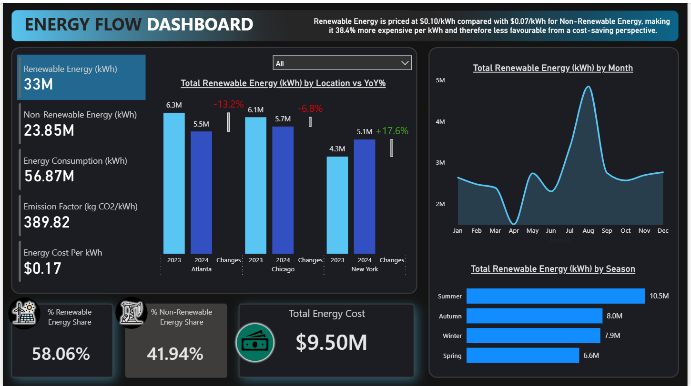
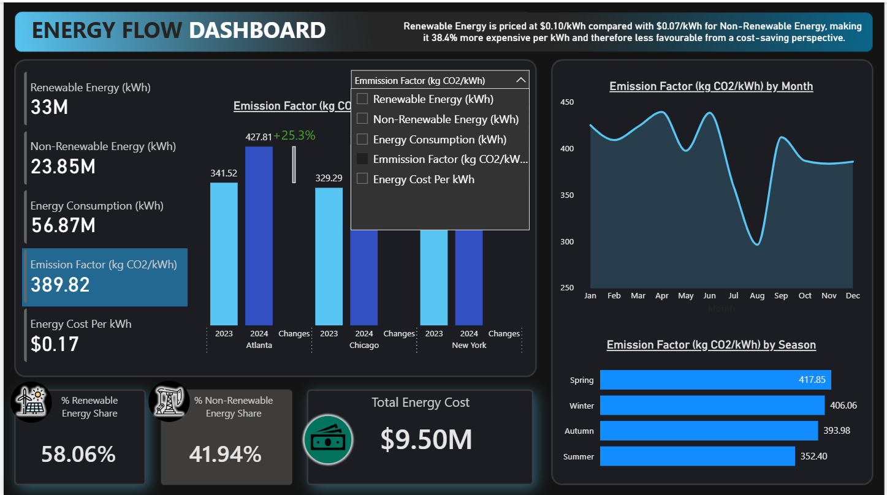
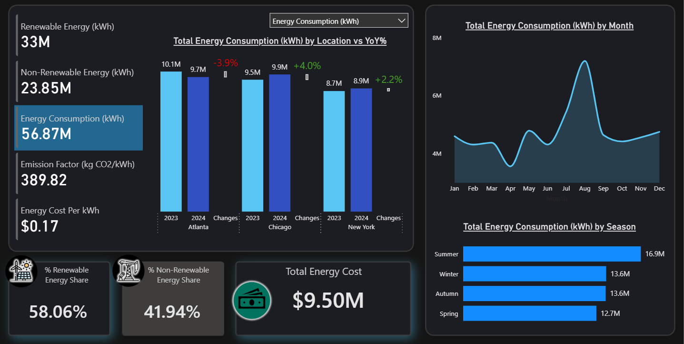
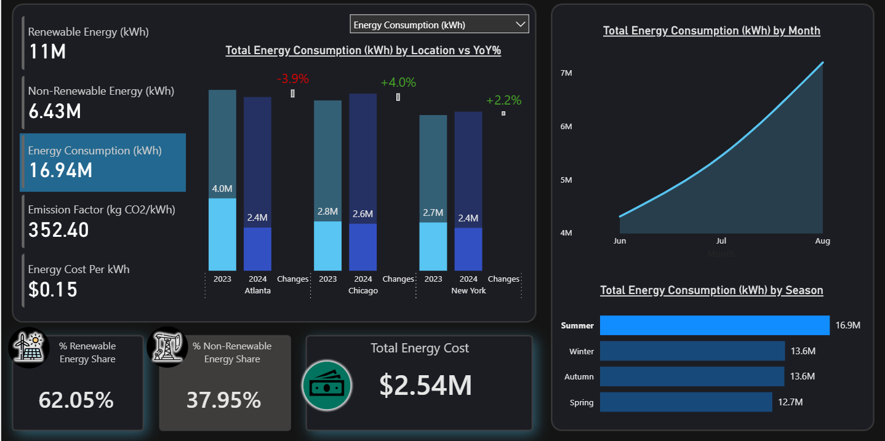
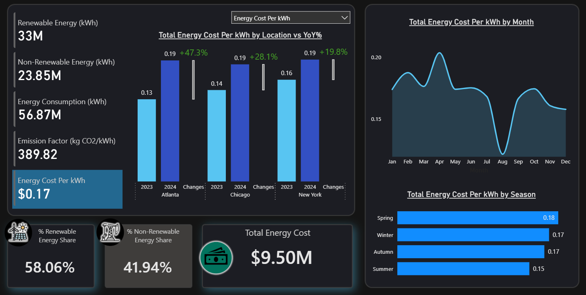

# Energy Flow Dashboard

## Project Links
- **Portfolio case study:** https://georgeoduk.github.io/energy-flow.html
- **GitHub repository:** https://github.com/GeorgeOduk/energy-flow-dashboard-powerbi

## Project Overview

This project is an interactive Power BI dashboard designed to analyse energy consumption, energy cost efficiency and emissions across selected US locations.

The dashboard compares renewable and non-renewable energy usage, highlights monthly and seasonal trends, and provides a clear view of cost and emissions performance. The report was built with a focus on developing dashboard design, DAX, Power Query and business intelligence reporting skills.

## Business Problem

Energy data can be difficult to interpret when consumption, cost and emissions are spread across multiple files, locations and time periods.

This dashboard helps users monitor energy performance by answering key questions such as:

- How much renewable and non-renewable energy is being consumed?
- How does energy consumption change over time?
- Which locations have the highest energy usage?
- How do energy costs differ by energy type?
- What seasonal patterns are visible in energy consumption?
- How do emissions vary across the selected locations?

## Project Brief

The dashboard was created to provide insights into energy consumption, cost efficiency and emissions. The analysis focuses on comparing renewable and non-renewable energy usage, highlighting key trends over time, breaking energy consumption down by month and season, and analysing cost differences between energy types.

The selected locations for the analysis are:

- Atlanta
- Chicago
- New York

## Tools Used

- Power BI Desktop
- Power Query
- DAX
- Excel
- PowerPoint for dashboard background design
- GitHub for project documentation

## Dashboard Features

### 1. Executive KPI Overview

The dashboard includes headline KPI cards showing key energy performance metrics such as total energy consumption, renewable energy, non-renewable energy, cost and emissions.

### 2. Renewable vs Non-Renewable Energy Analysis

The report compares renewable and non-renewable energy usage to show how the energy mix changes across locations and time periods.

### 3. Dynamic Measure Selection

A metric switcher allows users to toggle between different measures, making the dashboard more interactive and flexible.

### 4. Monthly Trend Analysis

The dashboard shows energy trends across months, allowing users to identify changes in consumption and cost over time.

### 5. Year-over-Year Comparison

Year-over-year analysis is included to highlight growth or decline in key energy metrics.

### 6. Seasonal Energy Breakdown

The report includes a seasonal breakdown to show how energy usage changes across winter, spring, summer and fall.

### 7. Cost and Emissions Analysis

The dashboard analyses energy cost and emissions performance, helping users understand both financial and environmental impact.

### 8. Modern Dark-Themed Design

The report uses a modern dark-themed layout designed to make KPIs and trend visuals clear, readable and visually engaging.

## Dashboard Preview

### Main Dashboard Overview

### Dynamic Metric Switcher

### Trend Analysis

### Seasonal Breakdown

### Cost Summary

## Key Skills Demonstrated

- Power BI dashboard development
- Power Query data transformation
- Combining multiple Excel files
- Data modelling
- DAX measure creation
- Field parameters
- Dynamic measure switching
- KPI reporting
- Year-over-year analysis
- Seasonal analysis
- Conditional formatting
- Dashboard UI design
- Business intelligence reporting
- Data storytelling

## Project Files

| File/Folder | Description |
|---|---|
| `powerbi/Energy_Flow_Dashboard.pbix` | Main Power BI dashboard file |
| `data/raw/` | Raw Excel files used for the dashboard |
| `images/` | Dashboard screenshots |
| `docs/dashboard_brief.pdf` | Original dashboard brief |
| `docs/project_summary.md` | Written project summary |
| `docs/dax_measures.md` | Summary of DAX measures and logic |

## Key Outcome

The final dashboard provides a clear and interactive view of energy consumption, costs and emissions across Atlanta, Chicago and New York. It allows users to compare renewable and non-renewable energy usage, monitor trends over time, and identify seasonal and cost-related patterns.

This project demonstrates my ability to build an end-to-end Power BI dashboard from multiple raw Excel files, apply data transformation and modelling steps, create DAX measures, and present insights in a professional business intelligence format.
